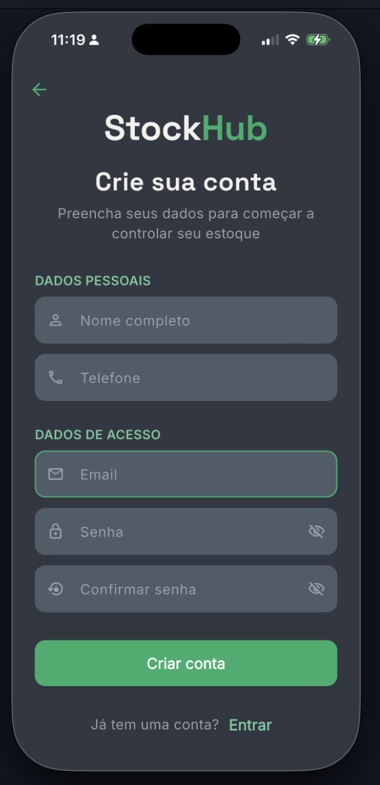
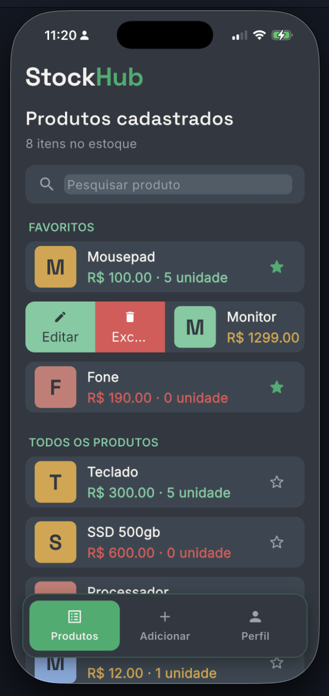
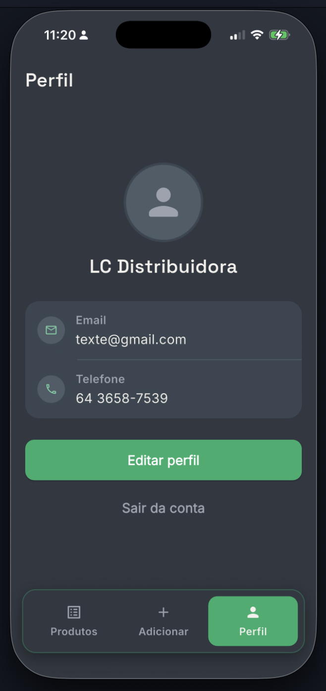
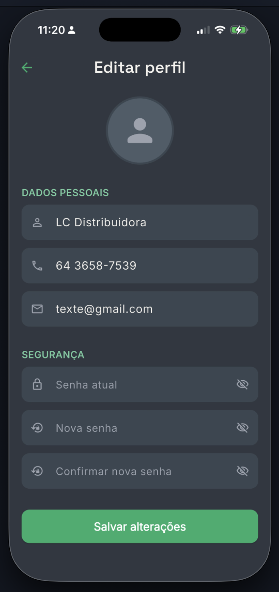

# StockHub

Controle de estoque simples e rápido para pequenos negócios (mercadinhos, adegas, lojas de conveniência), feito em Flutter com Firebase.

Cada conta é uma empresa: cadastre produtos, acompanhe o que está em estoque, controle preços e fornecedores, e gerencie tudo direto do celular — Android e iOS. O estoque de uma conta nunca aparece para outra.

<p align="center">
  <table>
    <tr>
      <td align="center">
        <br />
        <sub><b>Criar conta</b></sub>
      </td>
      <td align="center">
        <br />
        <sub><b>Login</b></sub>
      </td>
      <td align="center">
        <br />
        <sub><b>Produtos</b></sub>
      </td>
      <td align="center">
        <br />
        <sub><b>Adicionar produto</b></sub>
      </td>
    </tr>
    <tr>
      <td align="center">
        <br />
        <sub><b>Editar/excluir</b></sub>
      </td>
      <td align="center">
        <br />
        <sub><b>Perfil</b></sub>
      </td>
      <td align="center">
        <br />
        <sub><b>Editar perfil</b></sub>
      </td>
    </tr>
  </table>
</p>

## Funcionalidades

- **Autenticação completa** — cadastro, login, recuperação de senha por email e troca de senha com reautenticação (Firebase Auth)
- **Estoque isolado por conta** — cada login representa uma empresa; os produtos ficam em `users/{uid}/produtos` no Firestore, então uma conta nunca vê o estoque de outra
- **Catálogo de produtos** — nome, categoria, SKU, descrição, preço de custo e de venda, quantidade, unidade de medida, estoque mínimo, fornecedor e localização no estoque
- **Edição e exclusão de produtos** — com confirmação antes de excluir
- **Favoritos** — produtos marcados como favoritos ficam fixados no topo da lista e da busca
- **Indicadores de estoque** — sinalização automática de "estoque baixo" e "sem estoque" com base na quantidade e no mínimo configurado
- **Perfil do usuário** — nome, email e telefone reais, carregados do cadastro; edição com validação
- **Feedback visual consistente** — diálogos padronizados de sucesso, aviso, erro e confirmação em todo o app
- **Navegação por abas** — barra inferior própria (sem depender de pacote externo), com ícones e rótulos entre Produtos, Adicionar e Perfil

## Tecnologias

- [Flutter](https://flutter.dev) / Dart
- [Firebase](https://firebase.google.com): Authentication e Cloud Firestore
- [google_fonts](https://pub.dev/packages/google_fonts) — tipografia
- [flutter_slidable](https://pub.dev/packages/flutter_slidable) — ações de deslizar nos cards de produto

## Como rodar o projeto

### Pré-requisitos

- [Flutter SDK](https://docs.flutter.dev/get-started/install) instalado e configurado (`flutter doctor` sem erros)
- Um projeto no [Firebase Console](https://console.firebase.google.com) com **Authentication** (email/senha) e **Cloud Firestore** ativados
- Para iOS: Xcode + CocoaPods instalados (deployment target 15.6+)

### Passo a passo

```bash
# Clone o repositório
git clone https://github.com/Paullohz/controlador_de_estoque.git
cd controlador_de_estoque

# Instale as dependências
flutter pub get

# Configure o Firebase do seu próprio projeto
# (gera lib/firebase_options.dart automaticamente)
dart pub global activate flutterfire_cli
flutterfire configure

# Rode o app
flutter run
```

No iOS, depois do `flutter pub get`, rode também:

```bash
cd ios && pod install && cd ..
```

### Regras de segurança do Firestore

Como cada conta representa uma empresa isolada, publique estas regras no Firebase Console (**Firestore Database → Regras**) antes de usar o app com dados reais:

```
rules_version = '2';
service cloud.firestore {
  match /databases/{database}/documents {
    match /users/{userId} {
      allow read, write: if request.auth != null && request.auth.uid == userId;

      match /produtos/{produtoId} {
        allow read, write: if request.auth != null && request.auth.uid == userId;
      }
    }
  }
}
```

## Estrutura do projeto

```
lib/
├── main.dart                       # Ponto de entrada, rotas e tema
├── firebase_options.dart           # Config do Firebase (gerado pelo FlutterFire CLI)
├── models/
│   └── produtos.dart                # Modelo de dados do produto
├── repositories/
│   └── produtos_repository.dart     # Acesso ao Firestore (isolado por usuário)
├── pages/                           # Telas do app
│   ├── login_page.dart
│   ├── register.dart
│   ├── menu_page.dart                # Shell com as abas
│   ├── ProductsListScreen.dart
│   ├── add_produtos.dart
│   ├── edit_produto.dart
│   ├── profilescreen.dart
│   └── EditProfile.dart
├── theme/
│   └── app_theme.dart                # Cores, tipografia e ThemeData centralizados
└── widgets/                          # Componentes reutilizáveis
    ├── app_bottom_bar.dart            # Barra de navegação inferior própria
    ├── app_dialogs.dart               # Diálogos/snackbars padronizados
    ├── app_logo.dart
    ├── product_avatar.dart            # Ícone gerado a partir do nome do produto
    ├── profile_avatar.dart
    └── slidable_custom.dart           # Card de produto com ações de deslizar
```

## Roadmap

- [ ] Login com Google/Apple
- [ ] Múltiplos usuários por empresa (hoje cada conta é uma empresa isolada)
- [ ] Relatórios e exportação do estoque
- [ ] Notificações de estoque baixo

## Contribuindo

Pull requests são bem-vindos. Pra mudanças maiores, abra uma issue antes pra alinharmos a ideia.
