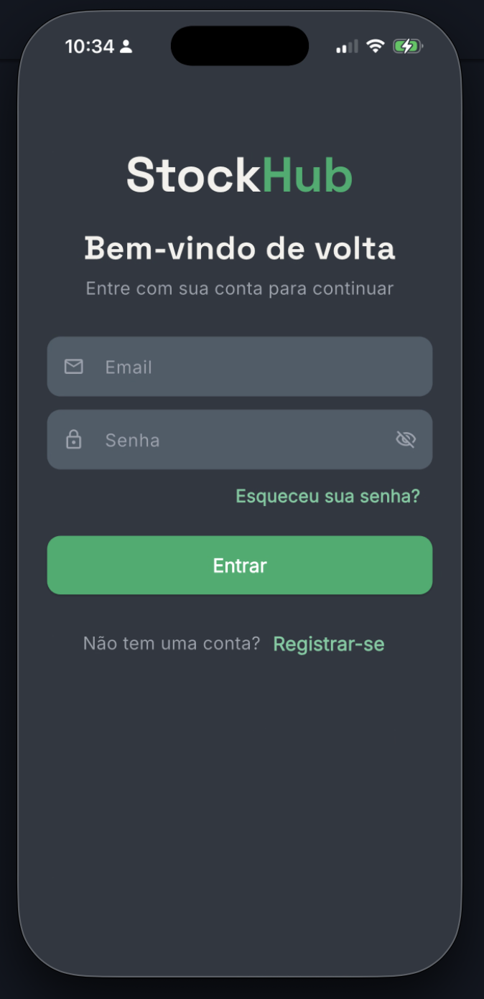
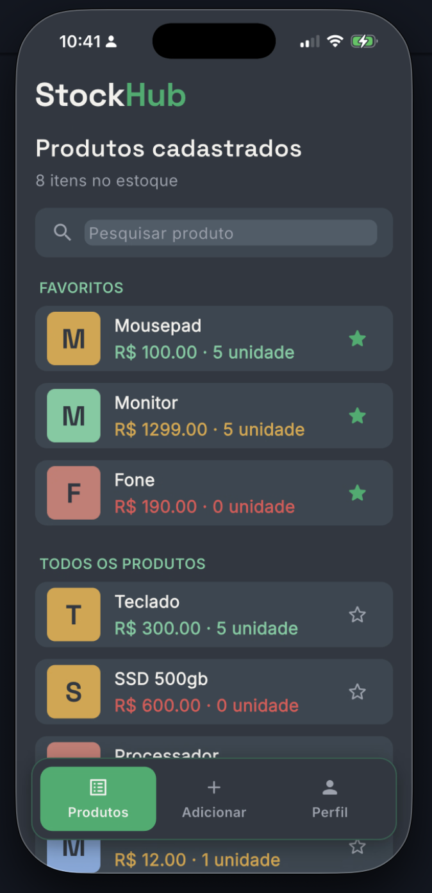
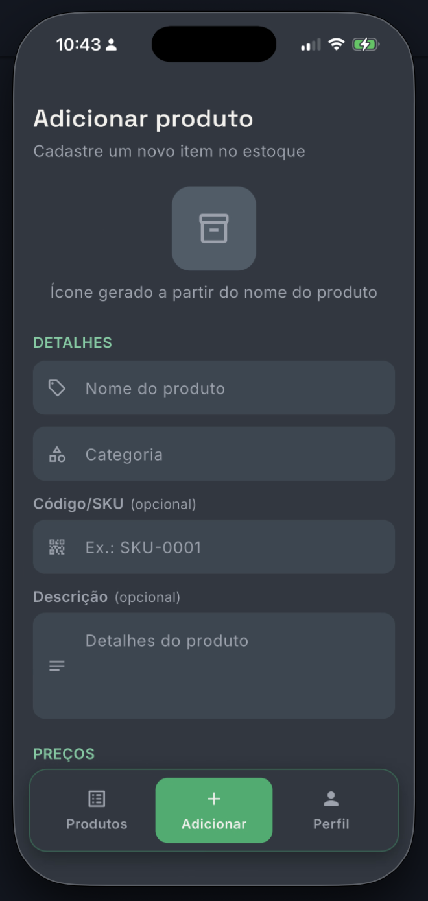

# StockHub

Controle de estoque simples e rápido para pequenos negócios (mercadinhos, adegas, lojas de conveniência), feito em Flutter com Firebase.

Cadastre produtos com foto, acompanhe o que está em estoque, edite seu perfil e gerencie tudo direto do celular — Android e iOS.

<!--
  Dica: troque os links abaixo por prints reais do app assim que tiver.
  Fica muito mais convidativo pra quem chega no repositório.
-->
<p align="center">
  
  
  
</p>

## Funcionalidades

- **Autenticação** — login e cadastro com email/senha (Firebase Auth)
- **Catálogo de produtos** — adicionar, listar, buscar e excluir produtos
- **Fotos de produto** — upload de imagem direto da galeria pro Firebase Storage
- **Perfil de usuário** — visualizar e editar nome, email, telefone e foto
- **Navegação por abas** — barra de navegação curva entre Produtos, Adicionar e Perfil

## Tecnologias

- [Flutter](https://flutter.dev) / Dart
- [Firebase](https://firebase.google.com): Auth, Cloud Firestore, Realtime Database, Storage
- [google_fonts](https://pub.dev/packages/google_fonts), [flutter_slidable](https://pub.dev/packages/flutter_slidable), [curved_navigation_bar](https://pub.dev/packages/curved_navigation_bar), [image_picker](https://pub.dev/packages/image_picker)

## Como rodar o projeto

### Pré-requisitos

- [Flutter SDK](https://docs.flutter.dev/get-started/install) instalado e configurado (`flutter doctor` sem erros)
- Um projeto no [Firebase Console](https://console.firebase.google.com) com Authentication, Firestore, Realtime Database e Storage ativados
- Para iOS: Xcode + CocoaPods instalados

### Passo a passo

```bash
# Clone o repositório
git clone https://github.com/Paullohz/controlador_de_estoque.git
cd controlador_de_estoque

# Instale as dependências
flutter pub get

# Configure o Firebase do seu próprio projeto
# (gera lib/firebase_options.dart automaticamente)
dart pub global activate flutterfire_cli
flutterfire configure

# Rode o app
flutter run
```

No iOS, depois do `flutter pub get`, rode também:

```bash
cd ios && pod install && cd ..
```

## Estrutura do projeto

```
lib/
├── main.dart                    # Ponto de entrada, rotas e tema
├── firebase_options.dart        # Config do Firebase (gerado pelo FlutterFire CLI)
├── models/                      # Modelos de dados (Produto)
├── pages/                       # Telas do app (login, produtos, perfil, etc.)
├── repositories/                # Acesso ao Firestore
├── theme/                       # Cores, tipografia e ThemeData centralizados
└── widgets/                     # Componentes reutilizáveis (cards, marca, etc.)
```

## Roadmap

- [ ] Edição de produtos existentes (hoje só dá pra trocar a foto)
- [ ] Controle de quantidade em estoque com alertas de reposição
- [ ] Login com Google/Apple
- [ ] Suporte a múltiplos usuários/lojas

## Contribuindo

Pull requests são bem-vindos. Pra mudanças maiores, abra uma issue antes pra alinharmos a ideia.

## Licença

Ainda sem licença definida — adicione um arquivo `LICENSE` (ex: MIT) se quiser deixar o uso claro para terceiros.
